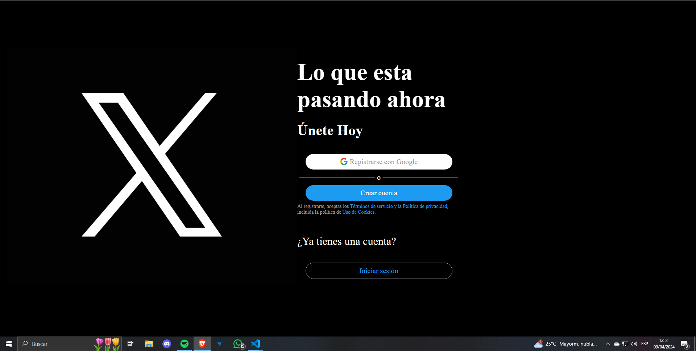
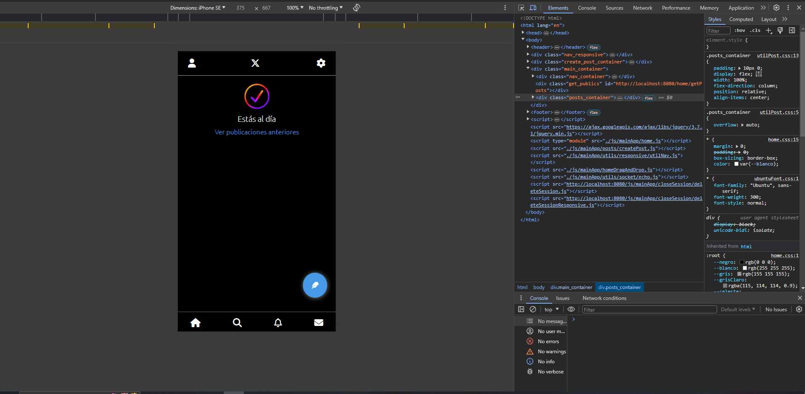

# Twitter clone

Clon de Twitter("X") totalmente responsive utilizando Laravel 10, en el cual podrás subir posteos, likearlos, recibir notificaciones en tiempo real, modificar datos de perfiles, realizar búsquedas, entre otras acciones.

Las tecnologias utilizadas para llevar a cabo este proyecto fueron:

- [Laravel](https://laravel.com/)

- [PHP](https://www.php.net/)

- [Xampp](https://www.apachefriends.org/es/index.html)

- [MySQL](https://www.mysql.com/)

- [Git](https://git-scm.com/)

- [JavaScript](https://developer.mozilla.org/es/docs/Web/JavaScript)

- [CSS](https://developer.mozilla.org/es/docs/Web/CSS)

Para poder utilizar la app necesitaremos tener instalado PHP, MySQL, Xampp, composer y npm. Así como también será necesario tener instalado git ,para clonar el repositorio.

## Tabla de contenidos

- [Información](#informacion-app)

- [Configuración](#configuración)

- [Instalación](#instalación)

  - [Comandos-configuración](#comandos-config)

  - [Archivo-env](#env)

    - [Codigo-aplicacion](#codigo-aplicacion)
    - [Base de datos](#base-de-datos)
    - [Pusher](#pusher)
    - [Mail](#mail)
    - [Imagenes](#imagenes)
  
  - [Google](#google-config)
  - [Levantar servidor](#levantar-servidor)

### informacion-app

Antes de comenzar quería hacer hincapié en que esta aplicación no es compleja como la app de Twitter, no existen las tendencias así como también no he decidido añadir la opción de repostear posteos.

Así también esta app utiliza varias tecnologías como Google para registrarse de una manera mas sencilla, laravel-websockets para recibir notificaciones en tiempo real entre otras. Las cuales comentaremos en su posterioridad como configurarlas.

### configuración

Listaremos los pasos por pasos para poder configurar correctamente la aplicación.

#### instalación

Para poder instalar correctamente la aplicación deberemos de ejecutar el siguiente comando en la terminal donde se desea de instalar:

``git clone "https://github.com/LuisVillalba1/twitter-clone"``

#### comandos-config

Lo primero que deberemos de realizar es instalar tantos las dependencias de composer como de npm, para ello hay que correr en la terminal de tu proyecto los siguientes comandos:

``npm install``

``composer install``

#### env

El archivo env es donde se encuentra almacenado toda la información sensible de la aplicación, en ella vamos a almacenar ciertos valores que nos permitirá correr ciertas dependencias y configuraciones de manera apropiada.

En la ruta de nuestra aplicación vamos a encontrar un archivo llamado ***.env.example***. A esta deberemos de cambiarle el nombre a **.env**

##### codigo-aplicacion

Deberemos de ejecutar un comando para poder cifrar los datos sensibles que vamos a utilizar, para ellos vamos a correr en la terminal

``php artisan key:generate``

Este nos generara un código aleatorio para la llave ***APP_KEY*** de nuestro archivo .env

##### base-de-datos
  
Como hablamos, esta aplicación va utilizar una base de datos relacional, en nuestro caso *MySQL*, aunque pueden utilizar otra base de datos relacional como, PostgreSQL, MariaDB, Oracle, etc.

Lo primero que deberemos de realizar es crear una base de datos y posteriormente a eso vamos a ingresar los valores correspondientes a nuestro archivo **.env** para que la conexión sea exitosa.

- DB_CONNECTION= *Base de datos utilizada*

- DB_HOST=*El host local de su computador normalmente este es 127.0.0.1*

- DB_PORT=*Puerto de su base de datos también,normalmente se utiliza el 3306*

- DB_DATABASE=*Nombre con el cual creo su base de datos*

- DB_USERNAME=*Nombre de usuario*

- DB_PASSWORD=*Contraseña*

##### pusher

Pusher es un servicio de mensajería en tiempo real que nos permitirá la integración de funcionalidades de tiempo real en nuestra aplicación para el recibimiento y creación de notificaciones.

En nuestro archivo **.env** vamos a tener una key que se llama "*BROADCAST_DRIVER*" con un valor de *log*,a esta
key le vamos a cambiar su valor por **pusher**.

Posterior a este paso vamos a cambiar algunos valores también de este archivo

- PUSHER_APP_ID=

- PUSHER_APP_KEY=

- PUSHER_APP_SECRET=

Estas keys deben de tener un valor **aleatorio no igual una con la otra** de formato cadena de texto, para ello pueden utilizar si quieren una app o pagina que te genera una string aleatoria e ingresarles los valores correspondientes.

##### mail

Nuestra aplicación va utilizar un mail, el cual va permitir enviar correos electrónicos a los usuario en caso de querer recuperar su cuenta o validar su dirección de correo electrónico.

Si bien puedes contratar un proveedor para enviar mails, en nuestro caso vamos a utilizar nuestro mail propio, concretamente utilizaremos Gmail.

Por lo cual primero de deberemos de generar una Contraseña de aplicación en nuestra cuenta de Gmail. Para ello vamos a nuestra cuenta de Google, en el apartado de arriba a la derecha, donde esta su logo, damos click.Nos dirigimos al apartado que dice *Administrar tu cuenta de Google*, y allí deberemos de dirigirnos hasta el apartado que dice *seguridad*.Una vez allí deberemos buscar la sección "*Cómo acceder a Google*" y haremos click en "*verificación en dos pasos*", en caso de nunca haber verificado tu cuenta vamos a tener que realizar la verificacion con los pasos que se les indica.

Una ves encontrados en aquel apartado vamos a ir abajo del todo, en "*Contraseñas de aplicación*" y ahí vamos a el nombre que queremos que se llame nuestra App. Esto nos devolverá **una contraseña encriptada** la cual deberemos de ingresar en nuestro archivo **.env**

A continuación mostraremos los valores que se deberán de modificar en nuestro archivo **.env**

- MAIL_MAILER=smtp

- MAIL_HOST= smtp.gmail.com

- MAIL_PORT=587

- MAIL_USERNAME=*nombre de su correo electronico*

- MAIL_PASSWORD=*Contraseña encriptada generada anteriormente*

- MAIL_ENCRYPTION=tls

- MAIL_FROM_ADDRESS=*Nombre del que envía el correo electrónico*

- MAIL_FROM_NAME="${APP_NAME}"

##### imagenes

A la hora de hacer posteos, se nos puede dar la idea de querer subir imagenes en concreto,en esta aplicacion vamos a poder realizarlo haciendo un sensillo paso.Colocado en la principal del proyecto, cree una nueva terminal y ejecuta el siguiente comando:

``php artisan storage:link``

Esto va generar un acceso directo de la carpeta sotorage, donde se almacenan las imágenes, a la carpeta public, para que pueda ser visualizada por los usuario.

#### google-config

Como nuestra app va usar Google como sistema de registro e inicio de sesión habrá que crear un nuevo proyecto en google-cloud. Para ello vamos a ingresar en el siguiente link, y crear un nuevo proyecto:

``https://console.cloud.google.com``

Si hay algún inconveniente de como crear una aplicación en google-cloud, puedes revisar el siguiente video que le pertenece a un youtuber (**El Rincón de Isma**) que me ayudo a configurarlo de manera efectiva.

``https://www.youtube.com/watch?v=C98LvIbPSf0&t=62s``

También dejo su canal de YouTube aquí abajo por si alguno quiere revisar su contenido

``https://www.youtube.com/@elrincondeisma``

Siguiendo con la configuración es importante que en el apartado **Dominios autorizados** deba de ingresar la url con la cual se va levantar el servidor, en este caso puede ser:

``http://localhost:8080``

Y en el apartado de **URI de redireccionamiento autorizados** se deberá de ingresar:

``http://localhost:8080/google-callback``

Posteriormente a estos pasos y haber guardado el proyecto, Google nos otorgara dos credenciales, *ID de cliente* y el *Secreto de cliente* ambos se deberán de ingresar en el archivo **.env**, en los apartados correspondientes de la siguiente manera

**GOOGLE_CLIENT_ID=ID de cliente**
**GOOGLE_CLIENT_SECRET=Secreto de cliente**

Y listo la configuración con Google estaría completa

#### levantar-servidor

Para levantar nuestro servidor deberemos de correr 3 comandos en distintas terminales, los cuales son:

``php artisan serve --port=8080``

``php artisan websockets:serve``

``npm run dev``

El primer comando levantara nuestro servidor en el servidor local de su computador; el segundo nos permitirá conectar nuestra aplicación son webosockets para poder trabajar con nuestras acciones en tiempo real; y el tercero nos permitirá compilar los archivos estáticos pertenecientes a la aplicación.

Si a la hora de ejecutar npm run dev, ocurre algun error, ejecute en la terminal el siguiente comando

``npm install autoprefixer``

Y luego ejecute en la misma terminal:

``npm run build``

``npm run dev``
